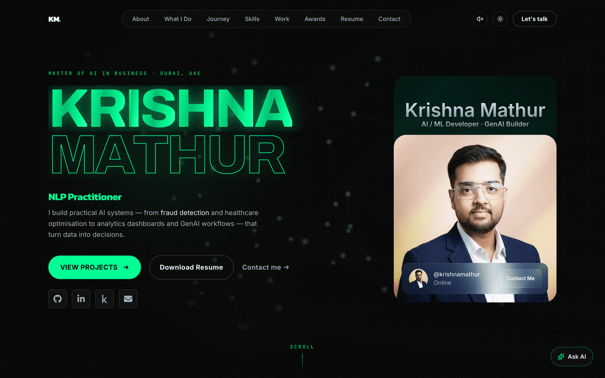

# Krishna Mathur — Portfolio

A modern, Awwwards-style personal portfolio for **Krishna Mathur** — AI Developer, Data Analyst & GenAI Builder. Built with React 19, TypeScript and Vite, featuring smooth scrolling, a WebGL/Three.js hero, motion-driven reveals, and a fully responsive, accessible layout.

---

## 1. Overview

This is a single-page portfolio that presents Krishna's work across AI, machine learning, NLP and data analytics. It is data-driven (content lives in `src/data/portfolio.ts`), type-safe, and production-ready for any static host. Heavy visuals degrade gracefully on low-power devices and respect `prefers-reduced-motion`.

## 2. Live Demo

**🔗 [krishnamathur-ai.vercel.app](https://krishnamathur-ai.vercel.app/)**

## 3. Preview



The hero renders an interactive WebGL "neural constellation"; project cards open rich case-study dialogs with real metrics.

## 4. Features

- 🧠 **Interactive 3D hero** — a pointer-reactive neural-constellation built with Three.js / React Three Fiber, **lazy-loaded** into its own chunk so it never blocks first paint, with a Canvas 2D fallback and full reduced-motion / low-power degradation.
- ⚡ **Smooth, momentum-based scrolling** (Lenis) with anchor navigation and an active-section nav pill.
- 📊 **Case-study modals** — every project opens an accessible dialog (focus-trap, ESC, scroll-lock) with Problem · Approach · What I built · Impact · real metrics · screenshot gallery.
- 🎨 **Cohesive design system** — single neon accent, one signature easing, custom cursor, film-grain texture, masked text reveals (Motion).
- 🧩 **Data-driven content** — every section reads from `src/data/portfolio.ts`. No copy is hard-coded in components.
- 📱 **Fully responsive** with a dedicated mobile menu and a desktop horizontal project gallery that falls back to a vertical stack on mobile.
- ♿ **Accessible** — semantic HTML, skip link, global keyboard focus rings, WCAG-AA text contrast, `aria-label`s, reduced-motion support, error boundary.
- 📨 **Working contact form** — posts to a Vercel serverless function that sends via **Resend**, with a honeypot + timing spam guard and a `mailto:` fallback.
- 🚀 **SEO-ready** — meta + Open Graph + Twitter tags, canonical URL, `robots.txt`, `sitemap.xml`, and JSON-LD `Person`/`WebSite` structured data.
- 🏎️ **Performance-first** — WebP imagery (≈92% smaller than source PNGs), code-split 3D, cache headers, and Vercel Speed Insights.
- 📄 **One-click resume download** via a Google Drive direct-download link.

## 5. Tech Stack

| Area | Tools |
|------|-------|
| Framework | React 19, TypeScript |
| Build tool | Vite 8 |
| Styling | Tailwind CSS v4 (`@tailwindcss/vite`) |
| Animation | Motion, Lenis (smooth scroll) |
| 3D / WebGL | Three.js, `@react-three/fiber` (lazy-loaded) |
| In-browser ML | `@huggingface/transformers` (RAG assistant + live sentiment demo), models + ONNX runtime WASM self-hosted under `public/models/` and `public/ort/` (same-origin, lazy-loaded only when a visitor opens the assistant or demo — see note below) |
| Contact API | Vercel serverless function + [Resend](https://resend.com) |
| Analytics | `@vercel/speed-insights` (Core Web Vitals) |
| Icons | lucide-react, react-icons |
| Tooling | ESLint (typescript-eslint, react-hooks, react-refresh) — passes clean |

> **Note — self-hosted ML models:** the RAG assistant and live sentiment
> demo load their models from this site's own origin
> (`src/lib/transformersEnv.ts`) instead of the Hugging Face CDN, because
> HF's CDN redirects to region-specific edge domains that a static CSP
> `connect-src` allowlist can't fully cover — that caused real "couldn't
> load the model" failures for some visitors. The trade-off: `public/models/`
> + `public/ort/` add ~110 MB of binary assets to the repo (never fetched
> unless a visitor opens the assistant/demo, so it doesn't affect page
> load). If clone/CI time ever becomes a problem, migrate `*.onnx`/`*.wasm`
> to Git LFS.

## 6. Folder Structure

```
Krishna_Portfolio/
├── api/
│   └── contact.ts          # Vercel serverless fn → Resend (honeypot + timing guard)
├── public/                 # Static assets served as-is
│   ├── avatar.webp         # Profile image (optimized)
│   ├── og-image.png        # Social share card (1200×630)
│   ├── favicon.svg
│   ├── robots.txt · sitemap.xml
│   ├── logos/              # Tech-stack marquee logos
│   └── projects/           # Optimized WebP project screenshots
├── src/
│   ├── components/
│   │   ├── common/         # Reveal, Cursor, Preloader, SafeExternalLink, LogoLoop, ...
│   │   ├── hero/           # NeuralGraphR3F (lazy WebGL), HeroBackdrop, NameNeurons (2D fallback)
│   │   ├── layout/         # Navbar, Footer, MobileMenu
│   │   ├── profile/        # ProfileCard
│   │   ├── projects/       # ProjectCard, ProjectCover, ProjectModal (case study)
│   │   └── sections/       # Hero, About, Stats, WhatIDo, Journey, Now, Capabilities, Projects, Recognition, Resume, Contact
│   ├── data/
│   │   └── portfolio.ts    # ← All editable content lives here
│   ├── hooks/              # useMediaQuery, useActiveSection, useWebGLSupport
│   ├── lib/                # SmoothScroll (Lenis wrapper)
│   ├── types/
│   │   └── portfolio.ts    # Project, Capability, Journey, Recognition, SocialLinks, Now types
│   ├── App.tsx · main.tsx · index.css
├── index.html              # SEO meta, OG, canonical, JSON-LD, fonts
├── vite.config.ts · vercel.json
├── package.json
└── README.md
```

> Note: content is organized around an AI portfolio (Journey, Capabilities, Recognition) rather than the generic Education/Skills/Experience split — all of it is editable in `src/data/portfolio.ts`.

## 7. Getting Started

**Prerequisites:** Node.js 18+ and npm.

```bash
git clone https://github.com/krish2105/Krishna_Portfolio.git
cd Krishna_Portfolio
npm install
npm run dev
```

The dev server starts at **http://localhost:5173**.

## 8. Available Scripts

| Script | Description |
|--------|-------------|
| `npm run dev` | Start the Vite dev server with HMR (http://localhost:5173) |
| `npm run build` | Type-check (`tsc -b`) and build for production into `dist/` |
| `npm run preview` | Serve the production build locally (http://localhost:4173) |
| `npm run lint` | Run ESLint |

## 9. Build for Production

```bash
npm run build      # outputs to dist/
npm run preview    # preview the production build locally
```

## 10. Deployment

This is a static SPA — the build output in `dist/` can be hosted anywhere.

**Universal settings:**

| Setting | Value |
|---------|-------|
| Install command | `npm install` |
| Build command | `npm run build` |
| Output directory | `dist` |

### Vercel
1. Import the GitHub repo at [vercel.com/new](https://vercel.com/new).
2. Vercel auto-detects Vite. Confirm: Build = `npm run build`, Output = `dist`.
3. Deploy. (`vercel.json` is included for explicit settings.)

### Netlify
1. "Add new site" → import from Git.
2. Build command `npm run build`, publish directory `dist`.
3. Deploy. (`netlify.toml` and `public/_redirects` are included.)

### GitHub Pages
GitHub Pages serves from a sub-path (`/<repo>/`), so set a base before building:
```bash
# vite.config.ts → defineConfig({ base: '/Krishna_Portfolio/', ... })
npm run build
npx gh-pages -d dist     # or use a GitHub Actions workflow
```
> Leave `base` unset (default `/`) for Vercel/Netlify/Cloudflare, which serve from the root.

### Cloudflare Pages
1. Connect the repo in the Cloudflare Pages dashboard.
2. Framework preset: **Vite**. Build command `npm run build`, output `dist`.

## 11. Environment Variables

The site **runs without any environment variables** — if none are set, the contact form gracefully falls back to opening the visitor's mail client (`mailto:`).

To enable **real inbox delivery** via [Resend](https://resend.com), set these in your Vercel project (Settings → Environment Variables). They power the serverless function at `api/contact.ts` and are **never exposed to the browser**:

```
RESEND_API_KEY=            # required — your Resend API key (re_...)
CONTACT_TO_EMAIL=          # optional — defaults to krishnamathur008@gmail.com
CONTACT_FROM_EMAIL=        # optional — a verified Resend sender; blank uses Resend's onboarding sender
```

> See [`.env.example`](.env.example). Note: the `api/contact.ts` function is a **Vercel** serverless function. On Netlify/Cloudflare/GitHub Pages the form still works via the `mailto:` fallback (or port the function to that platform's functions format). To verify a custom `from` domain, follow Resend's domain-verification flow.

## 12. Customization Guide

Almost everything is editable from **`src/data/portfolio.ts`**:

- `profile` — name, titles, location, about statements.
- `socialLinks` — GitHub, LinkedIn, email, etc. Set a value to `""` to hide that link.
- `RESUME_DRIVE_FILE_ID` — your Google Drive file ID (the part between `/d/` and `/view`). Powers the "Download Resume" button as a forced download.
- `services`, `journey`, `capabilities`, `projects`, `recognition` — section content.

Other touch points:
- **Profile image:** replace `public/avatar.png`.
- **SEO / social preview:** edit meta tags in `index.html`.
- **Tech marquee logos:** add SVGs to `public/logos/`.

### Personalization TODO
- [ ] Add real Instagram/Twitter/website links in `src/data/portfolio.ts` (currently hidden — `""` — since the old placeholders 404'd).
- [ ] **Rename the Vercel subdomain to match the code.** The codebase now points at `krishnamathur-ai.vercel.app` (corrected spelling) everywhere — canonical/OG/JSON-LD in `index.html`, `scripts/generate-project-pages.ts`, `sitemap.xml`, `robots.txt`. Rename the Vercel project's subdomain (Project Settings → Domains) to match, or point a real custom domain at it instead.
- [ ] **5 of 8 projects have no screenshots** (`smartloanbot`, `waselx`, `flower-classifier`, `talktodata`, `electric-production` in `src/data/portfolio.ts` all ship `images: []`). Each now has an honest "code/notebook available on request" note in place of a dead link — add a real screenshot or architecture diagram per project when available.
- [ ] Real testimonials, LinkedIn recommendations, mentor/faculty feedback and writing/articles — see `docs/CONTENT_TODO.md` (added in Phase 3 of the AI Command Center plan) for ready-to-send request templates.

## 13. Performance & Accessibility Notes

**Performance**
- The Three.js scene is `React.lazy`-loaded into a separate chunk — the main JS bundle (~160 KB gzip) is unaffected, so LCP stays fast. The scene also unmounts when the hero scrolls off-screen.
- All imagery is resized WebP (≈92% smaller than the source PNGs); static assets get `immutable` cache headers.
- Continuous hero animation is paused off-screen and skipped entirely under `prefers-reduced-motion`.

**Accessibility**
- Semantic landmarks, skip link, and a single `<h1>`.
- Global `:focus-visible` rings; the mobile menu and case-study modal are proper dialogs (focus-trap, ESC, body-scroll-lock).
- WCAG-AA text contrast; the custom cursor never removes keyboard focus visibility.
- Reduced-motion users get no smooth-scroll, no preloader animation, and the 2D/static hero fallback.

## 14. Contact

- **Email:** krishnamathur008@gmail.com
- **GitHub:** https://github.com/krish2105
- **LinkedIn:** https://www.linkedin.com/in/krishnamathurmay/
- **Location:** Dubai, UAE · Jaipur, India

## 15. License

This project is released under the MIT License. Content, branding and personal assets (name, resume, profile image, project descriptions) belong to Krishna Mathur and are not covered by the code license.
